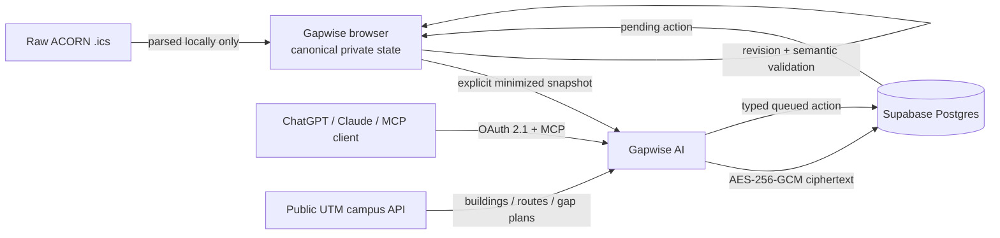

<div align="center">

# Gapwise AI

### Permissioned student context for AI assistants — backed by deterministic Gapwise data.

[](https://github.com/andrewmuratov/gapwise-ai/actions/workflows/ci.yml)
[](https://ai.gapwise.ca/api/mcp)
[](https://www.typescriptlang.org/)
[](https://nextjs.org/)
[](https://nodejs.org/)
[](LICENSE)

**[Gapwise](https://gapwise.ca)** · **[AI service](https://ai.gapwise.ca/api/health)** · **[Architecture](docs/ARCHITECTURE.md)** · **[Privacy](docs/PRIVACY.md)** · **[Threat model](docs/THREAT_MODEL.md)** · **[Security](SECURITY.md)**

</div>

---

Gapwise AI is the provider-neutral **Model Context Protocol (MCP)** layer for [Gapwise for UTM](https://gapwise.ca).

It lets ChatGPT, Claude, and other MCP-capable clients use a deliberately minimized slice of a student's Gapwise context — without turning the assistant into the source of truth for schedules, routing, or gap planning.

The core idea is simple:

> **Gapwise computes the facts deterministically. AI is an authorized interface to those facts.**

Academic meetings stay read-only. Delegation is explicit. Writes are typed and queued. Missing routing or accessibility evidence stays missing instead of being guessed.

> [!IMPORTANT]
> **Release status: private beta / public-release candidate.** The production service is live, but this repository intentionally remains private until real external ChatGPT and Claude OAuth read/write/revoke validation is complete and a final source-history secret scan is performed. See [`docs/RELEASE_CHECKLIST.md`](docs/RELEASE_CHECKLIST.md).

## Why this exists

Most assistant integrations become dangerous when the model is asked to both **interpret context** and **invent the underlying state**.

Gapwise already owns deterministic timetable, campus-routing, gap-planning, and leave-time logic. Gapwise AI exposes that existing truth through a narrow protocol boundary instead of duplicating it inside prompts.

| Principle | What Gapwise AI does |
| --- | --- |
| **Deterministic truth first** | Schedule arithmetic, gap assessments, and campus routing come from Gapwise, not the model. |
| **Explicit delegation** | Private tools fail closed unless the user has enabled AI access in Gapwise. |
| **Read-only academics** | No exposed tool can create, edit, or delete ACORN/source-backed classes. |
| **Bounded writes** | Personal-item and preference changes are typed, revision-bound, idempotency-aware, and queued for Gapwise. |
| **Grounding boundary** | Tool-returned Gapwise facts are clearly separated from assistant advice or inference. |
| **Public/private split** | Stateless UTM campus tools need no account; personal context requires OAuth + delegation. |
| **Uncertainty preserved** | Approximate, unavailable, unknown, and accessibility-unverified states are never silently upgraded. |

## Architecture



The **Gapwise browser remains canonical** for private student state. Gapwise AI receives only the delegated schema and exposes the same provider-neutral MCP contract to compatible clients.

For the full trust-boundary and data-flow model, see [`docs/ARCHITECTURE.md`](docs/ARCHITECTURE.md).

## Security model

Gapwise AI is designed so that making the source public does not create a new trust assumption.

| Property | Guarantee |
| --- | --- |
| **Opt-in** | AI delegation exists only after an explicit Gapwise action. |
| **Academic integrity** | Source-backed academic meetings cannot be mutated by AI tools. |
| **Data minimization** | Raw `.ics`, undelegated personal data, friend data, and precise live location are excluded. |
| **Key separation** | Gapwise AI does not receive Gapwise's primary private-data DEK/KEK. |
| **Storage encryption** | Delegated snapshots and queued actions are encrypted with a separate AI data key before database storage. |
| **Authorization** | Caller-scoped Supabase tokens and RLS constrain private rows and approved OAuth clients. |
| **Revision safety** | Stale actions fail instead of silently applying to newer student state. |
| **Idempotency** | Retry-safe write semantics prevent duplicate queued mutations. |
| **Semantic safety** | Fixed personal-item writes are revalidated against hard conflicts and known Gapwise transition/activity constraints. |
| **Revocation** | Revoking delegation removes delegated state/actions and later private access fails closed. |
| **Logging** | Prompt text, bearer tokens, decrypted timetable payloads, and private tool arguments/results are not intentionally logged. |

### Data that is deliberately not delegated

- raw ACORN `.ics` files;
- friend information;
- precise/live location;
- Gapwise's primary private-data encryption keys;
- credentials or unrestricted database access;
- arbitrary browser state outside the delegation schema.

This is **not zero-knowledge encryption**: authorized plaintext exists transiently inside the Gapwise AI runtime when a tool needs it. The boundary is documented precisely in [`docs/PRIVACY.md`](docs/PRIVACY.md) and [`docs/THREAT_MODEL.md`](docs/THREAT_MODEL.md).

## MCP endpoint

Canonical production endpoint:

```text
https://ai.gapwise.ca/api/mcp
```

OAuth protected-resource metadata:

```text
https://ai.gapwise.ca/.well-known/oauth-protected-resource
```

Health endpoint:

```text
https://ai.gapwise.ca/api/health
```

## 17 bounded tools

Gapwise AI currently exposes **4 stateless public campus tools** and **13 permissioned private tools**.

### Public UTM campus intelligence — no student account required

| Tool | Purpose |
| --- | --- |
| `list_utm_buildings` | List canonical UTM buildings with routing/accessibility coverage and provenance. |
| `get_utm_building` | Resolve one exact UTM building by code, name, or known alias. |
| `route_between_utm_buildings` | Run Gapwise's deterministic building-to-building campus router. |
| `plan_utm_gap_window` | Run deterministic route-aware gap assessment for an explicit campus window. |

These tools expose only the public campus-intelligence layer. They do not read a timetable, account, friend graph, location, or private sync state.

### Private read / decision tools — OAuth + explicit delegation

| Tool | Purpose |
| --- | --- |
| `get_ai_delegation_status` | Report whether AI access is enabled, with permissions and revision. |
| `get_my_day` | Return exact delegated schedule facts and Gapwise gap context for one date. |
| `get_my_week` | Return the normalized delegated timetable for one term. |
| `get_my_gap_plan` | Return the precomputed deterministic Gapwise assessment for one exact delegated gap. |
| `get_my_ai_preferences` | Return only explicitly delegated planning/routing preferences. |
| `get_my_decision_context` | Return compact planning context without forcing the client to reconstruct the whole timetable. |
| `find_my_available_windows` | Find bounded source-backed free windows without inventing wake/sleep assumptions. |
| `find_my_weekly_opportunities` | Search Monday–Friday for usable windows capped by Gapwise's deterministic activity budget. |
| `check_my_plan_feasibility` | Validate a proposed personal block against hard conflicts and known Gapwise gap constraints. |

### Private write tools — explicit write permission required

| Tool | Purpose |
| --- | --- |
| `create_personal_item` | Queue creation of a personal timetable item. |
| `update_personal_item` | Queue a bounded update to an AI-visible personal item. |
| `delete_personal_item` | Queue deletion of an AI-visible personal item. |
| `update_gap_preferences` | Queue a bounded partial update to delegated gap preferences. |

There is intentionally **no academic-meeting mutation tool**.

A successful MCP write means **queued for Gapwise**, not "the AI directly rewrote the user's canonical encrypted schedule." The Gapwise browser validates and applies pending actions against the current private state.

## Grounding contract

Gapwise AI makes a distinction that is easy for assistant integrations to blur:

- **Gapwise-grounded:** values actually returned by a Gapwise tool;
- **assistant inference/advice:** anything the model concludes, recommends, or knows from outside Gapwise.

Transit suggestions, amenity claims, general advice, and other unsupported context must not be presented as if Gapwise supplied them.

This boundary is enforced in tool metadata/output wording and covered by regression tests.

## Local development

### Requirements

- Node.js 24
- npm
- a Supabase project compatible with the documented schema

```bash
git clone https://github.com/andrewmuratov/gapwise-ai.git
cd gapwise-ai
npm ci
cp .env.example .env.local
npm run check
npm run dev
```

`npm run check` runs:

```text
TypeScript typecheck → unit tests → production build
```

CI additionally runs a **high-severity production dependency audit** and uses read-only GitHub Actions permissions.

Environment variables and their security requirements are documented in [`docs/ENVIRONMENT.md`](docs/ENVIRONMENT.md). Never commit credentials or place service secrets in `NEXT_PUBLIC_*` variables.

## Repository map

```text
app/                  Next.js routes: MCP, browser bridge, metadata, health
src/auth/             bearer-token verification + MCP/OAuth metadata
src/crypto/           delegated-payload envelope encryption
src/db/               caller-scoped Supabase REST adapter
src/delegation/       permission, revision, and queued-action service layer
src/domain/           schemas + deterministic schedule/decision queries
src/mcp/              tool registration, formatting, public campus bridge
src/http/             bounded request/response and CORS helpers
tests/                security, authorization, grounding, and domain regressions
docs/                 architecture, privacy, operations, deployment, contracts
```

## Documentation

| Document | Covers |
| --- | --- |
| [`ARCHITECTURE.md`](docs/ARCHITECTURE.md) | Trust boundaries and data flow |
| [`TOOL_CONTRACT.md`](docs/TOOL_CONTRACT.md) | MCP schemas and mutation semantics |
| [`PRIVACY.md`](docs/PRIVACY.md) | Delegated-data and disclosure model |
| [`THREAT_MODEL.md`](docs/THREAT_MODEL.md) | Threats, assumptions, and controls |
| [`ENVIRONMENT.md`](docs/ENVIRONMENT.md) | Runtime configuration and secret handling |
| [`DEPLOYMENT.md`](docs/DEPLOYMENT.md) | Vercel/Supabase production contract |
| [`OPERATIONS.md`](docs/OPERATIONS.md) | Fail-closed operation and incident handling |
| [`RELEASE_CHECKLIST.md`](docs/RELEASE_CHECKLIST.md) | Gates before broad/public release |

## Contributing

Contributions will be welcome once the repository is public.

Security-sensitive changes must preserve the documented trust boundaries and include regression coverage for any changed authorization, schema, encryption, grounding, or mutation behavior.

See [`CONTRIBUTING.md`](CONTRIBUTING.md).

## Security

Please **do not disclose vulnerabilities in a public issue**.

Follow [`SECURITY.md`](SECURITY.md) for responsible reporting and the project's non-negotiable security boundaries.

## Project relationship

Gapwise AI is part of the independent [Gapwise for UTM](https://gapwise.ca) project. It is not an official University of Toronto service and is not affiliated with or endorsed by the University of Toronto.

## License

[MIT](LICENSE) © 2026 Andrew Muratov.
