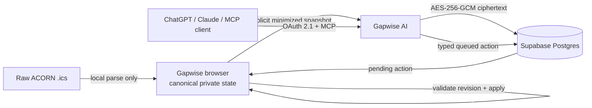

# Gapwise AI

**Permissioned AI access to Gapwise — through one provider-neutral MCP service.**

Gapwise AI is the secure integration layer between [Gapwise for UTM](https://gapwise.ca) and MCP-capable assistants such as ChatGPT and Claude. It lets a user explicitly delegate a minimized view of their timetable, ask an assistant questions grounded in exact Gapwise data, and optionally queue tightly bounded personal-planning changes.

The service is designed so that AI access does **not** require Gapwise's primary private-data encryption key, raw ACORN files, friend data, or live location.

> **Release status:** private beta. The service is deployed and the browser integration is live, but this repository intentionally remains private until real external OAuth clients complete the read/write/revocation validation matrix. See [`docs/RELEASE_CHECKLIST.md`](docs/RELEASE_CHECKLIST.md).

## Why this exists

Gapwise already has deterministic timetable, gap-planning, and campus-routing logic. AI clients should consume that source-backed truth rather than reimplementing it or inventing schedule facts.

Gapwise AI provides a single, standards-oriented boundary for that access:

- **provider-neutral** — one Streamable HTTP MCP endpoint for compatible clients;
- **explicitly delegated** — no delegation means private tools fail closed;
- **least-privilege** — optional data categories and every write capability require user permission;
- **source-backed** — academic meetings remain read-only and route-dependent facts are never fabricated;
- **revision-safe** — writes are queued against an expected snapshot revision and stale actions fail;
- **encrypted at rest** — delegated snapshots and queued actions are AES-256-GCM encrypted before Supabase storage;
- **user-scoped** — database access remains bound to the authenticated Gapwise user through Supabase Auth and RLS.

## Security and privacy model

| Property | Guarantee |
| --- | --- |
| Opt-in | AI delegation exists only after an explicit Gapwise action. |
| Academic integrity | ACORN/source-backed academic meetings cannot be mutated by AI tools. |
| Data minimization | Raw `.ics`, notes outside the delegated schema, friend data, precise live location, and unrelated browser state are excluded. |
| Key separation | Gapwise AI never receives Gapwise's primary private-data DEK/KEK. |
| Storage | AI snapshots/actions are encrypted with a separate server-only data key before database storage. |
| Authorization | Caller-scoped Supabase tokens plus RLS constrain private rows and approved OAuth clients. |
| Writes | Personal-item and preference mutations are typed, idempotency-bounded, revision-bound, and browser-applied. |
| Revocation | Revoking delegation removes delegated data/actions and subsequent private access fails closed. |
| Logging | Prompt text, tool arguments/results, bearer tokens, and decrypted timetable payloads are not intentionally logged. |

This is **not zero-knowledge encryption**: authorized plaintext exists transiently inside the Gapwise AI runtime when a tool needs it. The privacy boundary is documented precisely in [`docs/PRIVACY.md`](docs/PRIVACY.md) and the threat model in [`docs/THREAT_MODEL.md`](docs/THREAT_MODEL.md).

## Architecture



The Gapwise browser remains the canonical owner of the user's timetable/private state. Gapwise AI receives only the delegated schema and exposes one MCP contract to every supported provider.

For the full trust-boundary and data-flow description, see [`docs/ARCHITECTURE.md`](docs/ARCHITECTURE.md).

## MCP surface

Current production bootstrap endpoint:

```text
https://gapwise-ai.vercel.app/api/mcp
```

A first-party custom hostname under `gapwise.ca` is the intended public endpoint. The service origin is configurable through `GAPWISE_AI_ORIGIN`, so the MCP protocol and authorization model do not depend on a Vercel hostname.

OAuth protected-resource metadata is available at:

```text
https://gapwise-ai.vercel.app/.well-known/oauth-protected-resource
```

### Read tools

| Tool | Purpose |
| --- | --- |
| `get_ai_delegation_status` | Report the current delegated permissions/revision. |
| `get_my_day` | Return exact delegated schedule facts for a day. |
| `get_my_week` | Return exact delegated schedule facts for a week. |
| `get_my_gap_plan` | Return Gapwise's delegated deterministic gap assessment. |
| `get_my_ai_preferences` | Return explicitly delegated planning preferences. |

### Write tools

| Tool | Purpose |
| --- | --- |
| `create_personal_item` | Queue creation of a personal timetable item. |
| `update_personal_item` | Queue a bounded update to a personal timetable item. |
| `delete_personal_item` | Queue deletion of a personal timetable item. |
| `update_gap_preferences` | Queue an explicitly permitted preference update. |

There is intentionally **no academic-meeting mutation tool**.

`get_my_gap_plan` returns only a source-backed Gapwise assessment for the exact delegated gap. If the necessary routing/planning truth is unavailable, the tool reports that limitation instead of asking the model to invent it.

## Browser delegation API

The first-party Gapwise web app uses a separate authenticated browser bridge:

```text
GET    /api/delegation
DELETE /api/delegation
PUT    /api/delegation/snapshot
GET    /api/delegation/actions
POST   /api/delegation/actions/:id/complete
POST   /api/delegation/clients
DELETE /api/delegation/clients
```

MCP OAuth tokens cannot use the browser-authoritative mutation paths. Browser and third-party client capabilities are deliberately separated in both application code and database policy.

## Local development

### Requirements

- Node.js 24
- npm
- a Supabase project compatible with the documented schema

```bash
git clone https://github.com/andrewmuratov/gapwise-ai.git
cd gapwise-ai
npm ci
cp .env.example .env.local
npm run check
npm run dev
```

`npm run check` runs typechecking, unit tests, and a production build. CI additionally audits production dependencies at high severity.

Environment variables and their security requirements are documented in [`docs/ENVIRONMENT.md`](docs/ENVIRONMENT.md). Never commit credentials or place service secrets in `NEXT_PUBLIC_*` variables.

## Repository map

```text
app/                  Next.js routes: MCP, browser bridge, metadata, health
src/auth/             Supabase bearer-token verification and OAuth identity
src/crypto/           delegated-payload envelope encryption
src/db/               caller-scoped Supabase REST adapter
src/delegation/       permission/revision/action service layer
src/domain/           validated schemas and deterministic schedule queries
src/http/             bounded request/response and CORS helpers
tests/                security and domain regression tests
docs/                 architecture, privacy, operations, deployment, contracts
```

## Documentation

- [`ARCHITECTURE.md`](docs/ARCHITECTURE.md) — trust boundaries and data flow
- [`TOOL_CONTRACT.md`](docs/TOOL_CONTRACT.md) — MCP tool schemas and mutation semantics
- [`PRIVACY.md`](docs/PRIVACY.md) — delegated-data and disclosure model
- [`THREAT_MODEL.md`](docs/THREAT_MODEL.md) — threats, assumptions, and controls
- [`DEPLOYMENT.md`](docs/DEPLOYMENT.md) — Vercel/Supabase production contract
- [`OPERATIONS.md`](docs/OPERATIONS.md) — fail-closed operation and incident handling
- [`RELEASE_CHECKLIST.md`](docs/RELEASE_CHECKLIST.md) — gates before broad/public release

## Contributing

Contributions are welcome once the repository is public. Security-sensitive changes must preserve the documented trust boundaries and include tests for any changed authorization, schema, encryption, or mutation behavior.

See [`CONTRIBUTING.md`](CONTRIBUTING.md) before opening a pull request.

## Security

Please do **not** disclose vulnerabilities in a public issue. Follow [`SECURITY.md`](SECURITY.md) for responsible reporting and the project's non-negotiable security boundaries.

## Project relationship

Gapwise AI is part of the independent [Gapwise for UTM](https://gapwise.ca) project. It is not an official University of Toronto service and is not affiliated with or endorsed by the University of Toronto.

## License

[MIT](LICENSE) © 2026 Andrew Muratov.
